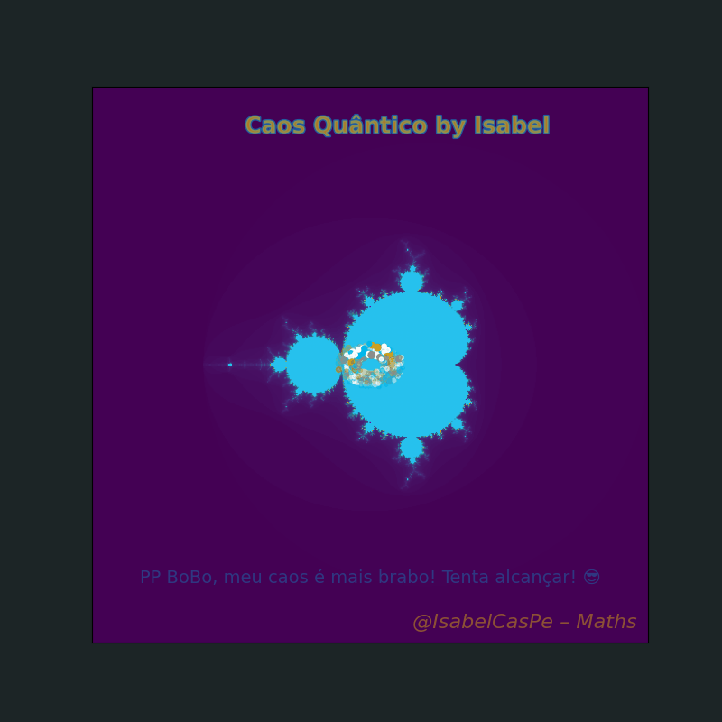
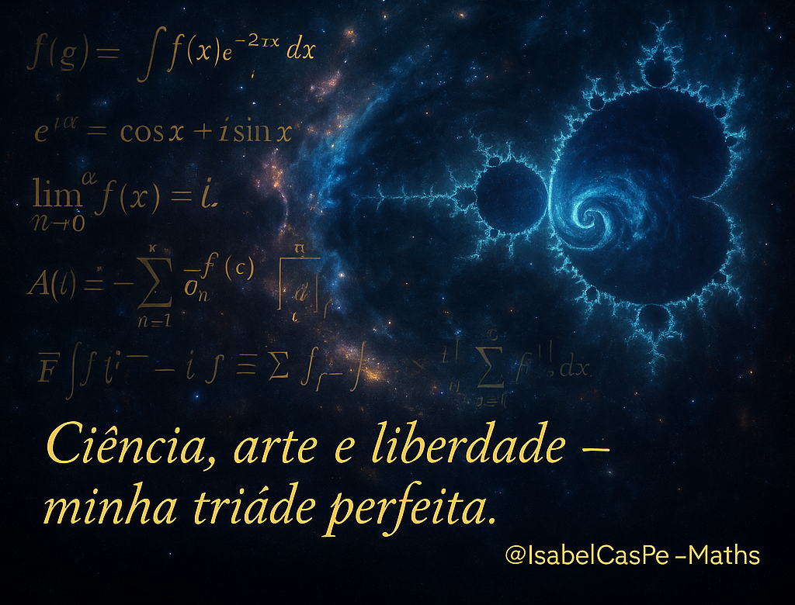

<!-- COSMIC HERO -->

  

  

  
  
  

  
  
  
  

  
  

## **Hi! there, I'm Ana Isabel Castillo! 👋**  

*Pesquisadora e professora* em **Matemática Aplicada** e **Finanças Quantitativas**, com paixão por **Ciência de Dados, Risco Sistêmico e Modelos em Rede**.  

🔭 Atualmente desenvolvendo projetos no repositório  

🌱 Aprimorando análises com **Python, LaTeX e Machine Learning** aplicados a finanças.  
💬 Adoro compartilhar conhecimento em **Cálculo, EDOs, EDPs e Estatística**.  
📫 Como me encontrar:  

  

  

**** 

---

## 🌠 **Featured Repositories** 🔢

💎 **Descubra meus repositórios** com **códigos, exercícios e simulações** em **Matemática Aplicada, Sistemas Dinâmicos e Finanças Quantitativas**: 

  
**Ciência de Dados** com foco em aplicações quantitativas e financeiras.

  
**Exercícios de Séries de Fourier e Equações Diferenciais Parciais.**

  
**Curso completo de Cálculo I a III com aplicações em Finanças.**

  
**Materiais para alunos**, com tutoriais e exercícios guiados.

  
**Códigos e simulações** de **caos, fractais e dinâmicas não lineares.**

  
**Notas e exercícios** sobre **processos estocásticos** e cadeias de Markov.

  
**Métodos Numéricos** aplicados à Engenharia e Ciências Exatas.

  
**Sistemas Lineares e Controle** com modelagem e estabilidade.

  
**Matemática Financeira e Engenharia Econômica** — cálculos e simulações.

  
**Leituras** e **materiais avançados** em Matemática Aplicada.

  
**Controle Ótimo** com aplicações em Finanças e Engenharia.

  
**Animações** de **fenômenos matemáticos e equações dinâmicas.**

  
**Piadas inteligentes e humor matemático** — *porque rir também é derivar!*  

  
**Um painel** **enxuto e claro** para acompanhar o funil comercial — *stages*, conversões e **cycle time** — com delicadeza visual e rigor analítico.  

  
> *“O dado conta a história; o desenho só abre caminho.”* 💛

---

## 🔒 **Projetos de acesso reservado (VIP)**  

[-0A3D91)]()  
[-1E90FF)]()  
[-4682B4)]()  
[-4169E1)]()  
[-2E8B57)]()  
[-4B0082)]()  
[-D4AF37)]()  
[-483D8B)]()  
[-5F9EA0)]()  
[-FFD700)]()

---

## 📬 **Contato**  

---

## 📜 License

Este perfil e os repositórios aqui destacados estão sob a licença :

---

  

---

  
    
  <b>@IsabelCasPe</b> 👑 💙 🌌 “Cosmos em código: ciência que vira arte.” 🌐 💎 ♾️  
    
  💡 <i>“Entre fórmulas e fractais, há poesia - e propósito.”</i>  

  

  

---

  
 
 
 

  

  

  

  <strong>“Ciência, arte e liberdade — minha tríade perfeita.”</strong> 
  @IsabelCasPe – Maths 💙

